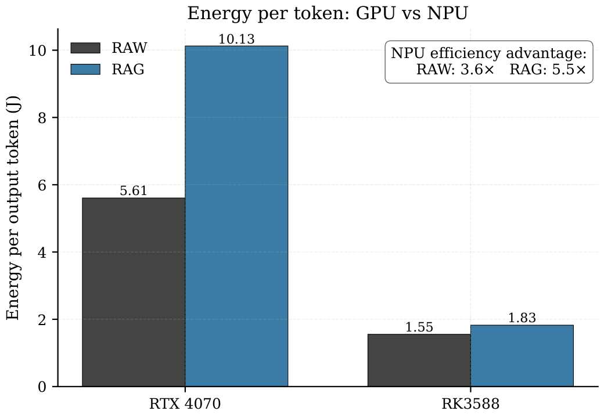
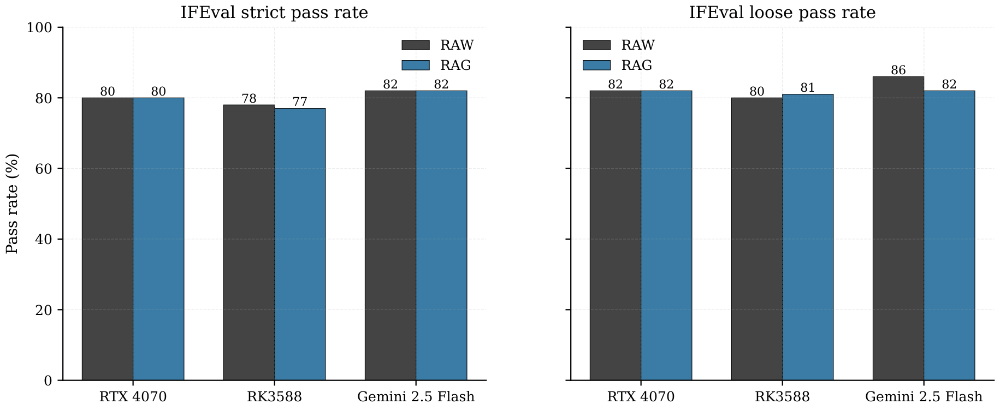

# Edge vs Cloud LLM Inference Dissertation
Final year dissertation: "Evaluating the capabilities and hardware limitations of Edge AI VS Cloud AI" between an RK3588 NPU, RTX 4070, and Gemini Cloud API, graded First Class. Here are some of the headline findings:

- The RK3588's NPU proved to be 3.6x to 5.5x more energy efficient per token than the RTX 4070's GPU
- The quality gap on IFEval pass rates was a minor ~5% across all 3 models
- RAG doubles TTFT on both edge platforms but doesn't improve IFEval pass rates
- The NPU had the slowest throughput but the highest energy efficiency, surpassing the accepted 5 TPS conversational floor needed for a voice assistant 

The artefact is a benchmarking harness comparing LLM inference between the three platforms, measuring the quality with IFEval, throughput, and energy consumption via hardware power measurement. The harness script runs on Windows and talks via local network to an rkllama server instance on an Orange Pi specific ubuntu version. The hardware and stack is as follows:

- RTX 4070 (GPU baseline using llama.cpp)
- Orange Pi 5 Plus, RK3588 (NPU baseline using rkllama)
- Gemini API (Cloud baseline)
- TP-Link Tapo P110 smart plug for realtime energy measurement
- Python, FAISS / RAG, llama.cpp, rkllama

Here are a couple of the graphs from the final dissertation illustrating the headline findings:

  
  

[Read the full dissertation (PDF)](Dissertation.pdf)

Note: Full reproducibility would require the original hardware setup outlined in the full dissertation, so the code is included for transparency and reference, not ease of reproducibility 
